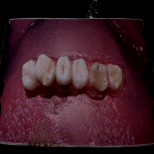
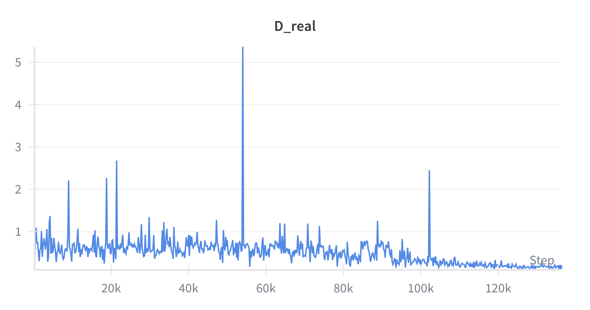
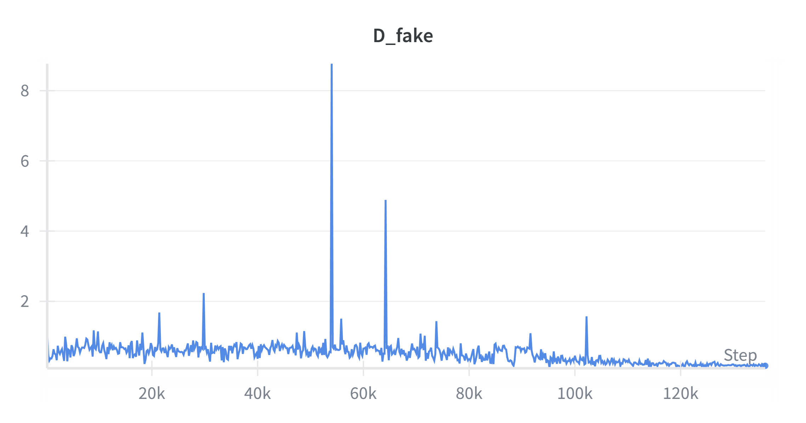

# Teeth Water Removal (Baseline: pix2pix)

This repository contains the baseline experiment for removing water artifacts from intraoral scanner images using Generative Adversarial Networks (GANs).

## 🎯 Project Goal
The goal is to digitally remove water/saliva from dental scans to improve the visibility of tooth structures. The current approach uses the **pix2pix** architecture (paired image-to-image translation).

## 📂 Dataset Details
The data was sourced from the internal dataset `_public/Vident-Water`.

### 1. Training Set
- **Source Path:** `_public/Vident-Water/I/1pb_1/camera1`
- **Input (Wet):** 680 images (Range: `frame_00650` to `frame_01329`)
- **Target (Dry):** 1 reference image (`frame_00000`)
- **Note:** The single dry reference image was paired with all 680 wet frames for training.

### 2. Validation / Test Set
- **Source Path:** `_public/Vident-Water/I/1pb_2/camera1/`
- **Input (Wet):** 100 images (Range: `frame_00875` to `frame_00974`)
- **Split:** These images were strictly excluded from the training process to evaluate generalization.

### Preprocessing
- Images were resized and cropped to 256x256 resolution during training to fit the standard pix2pix architecture.

## 🚀 Training Configuration
We trained a standard pix2pix model on an HPC cluster (A100 GPU).

**Hyperparameters:**
- **Model:** pix2pix (U-Net 256 generator + PatchGAN discriminator)
- **Epochs:** 100 (constant LR) + 100 (linear decay)
- **Batch Size:** 8
- **Direction:** AtoB (Wet -> Dry)
- **Optimizer:** Adam (lr=0.0002, beta1=0.5)

**Run Command:**
python train.py \
  --dataroot . \
  --name teeth_full_run_v1 \
  --model pix2pix \
  --dataset_mode teeth \
  --direction AtoB \
  --use_wandb \
  --wandb_project_name teeth-removal-full \
  --n_epochs 100 \
  --n_epochs_decay 100 \
  --batch_size 8 \
  --preprocess resize_and_crop \
  --save_epoch_freq 5 \
  --display_freq 100

## 🧪 Validation Results
To evaluate the model on the unseen validation set (100 images from 1pb_2):

python test.py \
  --dataroot ./val \
  --name teeth_full_run_v1 \
  --model pix2pix \
  --dataset_mode teeth \
  --direction AtoB \
  --preprocess resize_and_crop \
  --num_test 100

## 📸 Visual Results
Here is a sample comparison from the test set (`frame_00894`):

| **Input (Wet)** | **Model Output (AI)** | **Ground Truth (Dry)** |
|:---:|:---:|:---:|
|  |  |  |
| *Original image with water artifacts* | *Processed by pix2pix* | *Reference dry image* |

### 📈 Training Analysis & Metrics

We monitored 4 key metrics to evaluate the model's performance and stability.

### 1. Visual Fidelity (Primary Metric)
**Metric:** `G_L1` (Reconstruction Loss)
This graph represents the visual difference between the AI output and the real dry teeth.
* **Interpretation:** The curve flattened around epoch 50 (value ~3.5), indicating the model reached its maximum potential for removing water artifacts.

---

### 2. Adversarial Dynamics (Technical Analysis)
These charts explain *why* the training stopped improving. We observe a "victory" of the Discriminator over the Generator.

| **Generator Struggle** | **Discriminator (Real Images)** | **Discriminator (Fake Images)** |
| :---: | :---: | :---: |
| **`G_GAN`** | **`D_real`** | **`D_fake`** |
|  |  |  |
| *Loss increases $\nearrow$* The Generator fails to trick the Discriminator. | *Loss drops to 0 $\searrow$* Discriminator perfectly identifies real images. | *Loss drops to 0 $\searrow$* Discriminator perfectly catches fakes. |

**Conclusion:** The collapse of `D_real` and `D_fake` to near-zero values proves that the Discriminator became too strong, preventing further learning. This confirms the need to switch to a non-adversarial architecture like **Restormer**.